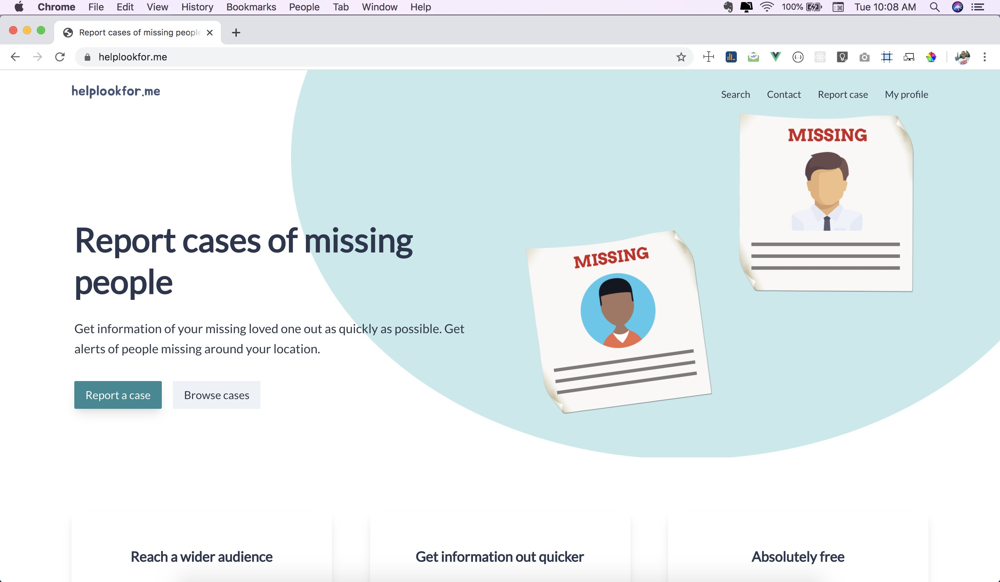

# helplookforme

A platform that helps people report cases of their missing loved one quickly and easily. It gives people an opportunity to take action as quickly as possible by immediately reporting cases of their missing loved ones. Our platform helps you spread information about a missing loved one as quick as possible and to the target audience. Each reported case is sent to all our subscribers that live within a 100km radius from where the person got missing. The missing person's information is also automatically posted on our twitter account https://twitter.com/helplookforme to help raise awareness.



## Technologies
- Vue.js :heart:
- Tailwind CSS

## Project setup

#### Clone this repo
Clone this repository by running 
```
git clone https://github.com/georgeben/helplookforme
```

#### Install dependencies
Run
```
npm install
```

#### Set up .env file
Create a .env file, copy the contents of .env.sample file into it and add appropriate credentials
- VUE_APP_DEV_API_BASE_URL= The url to make API calls to (during development)
- VUE_APP_API_URL= The url to make API calls to (in production)
- VUE_APP_APP_ENV=development (environment the app is run)
- VUE_APP_GOOGLE_CLIENT_ID= Get yours at https://developers.google.com/identity/sign-in/web/sign-in
- VUE_APP_STAGING_API_URL= The url to make API calls to (in staging)
- VUE_APP_CLARIFY_API_KEY= Get yours at https://docs.clarifai.com/api-guide/authentication

#### Compiles and hot-reloads for development
```
npm run serve
```

#### Compiles and minifies for production
```
npm run build
```

#### Run your unit tests
```
npm run test:unit
```

#### Lints and fixes files
```
npm run lint
```

### Customize configuration
See [Configuration Reference](https://cli.vuejs.org/config/).
